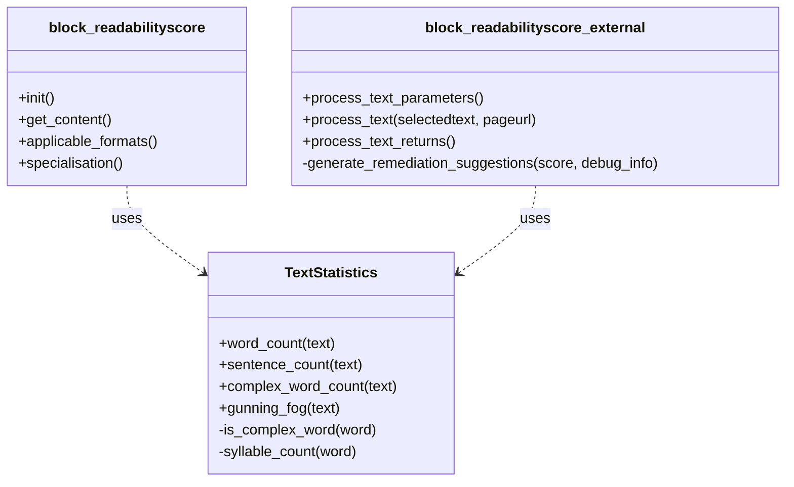
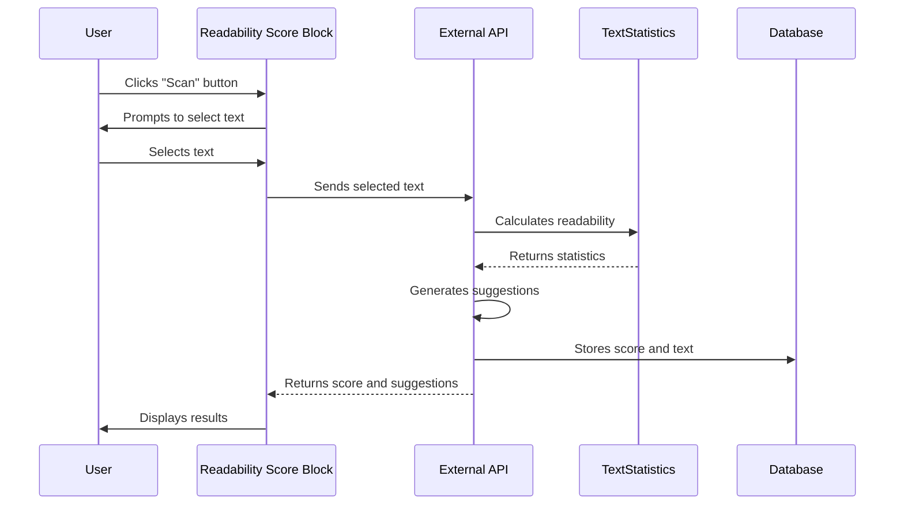
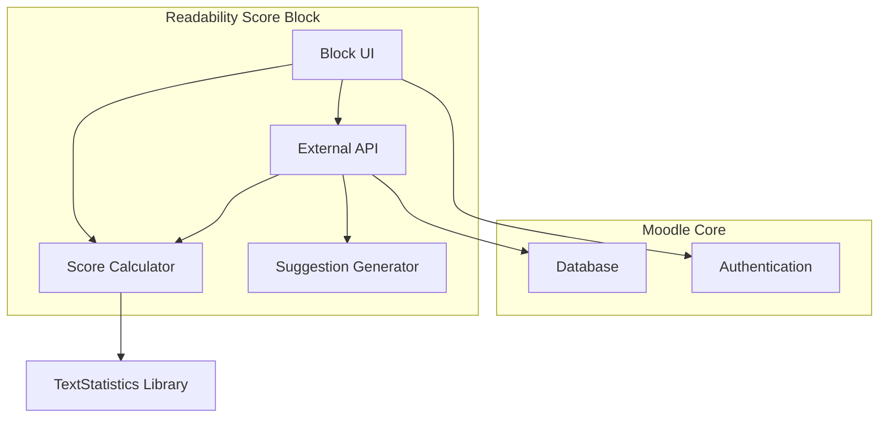

# Readability Score Moodle Block

## Overview

The Readability Score block is a Moodle plugin that allows users to analyse the readability of text content within Moodle. It uses the Gunning Fog Index to calculate readability scores and provides suggestions for improving the text's clarity.

## Features

- Calculate readability scores using the Gunning Fog Index
- Provide instant feedback on text complexity
- Offer targeted suggestions for improving readability
- Store and display historical readability data
- Dashboard for viewing readability statistics across pages

## Requirements

- Moodle 3.9 or higher
- PHP 7.3 or higher

## Installation

1. Open a terminal and navigate to your Moodle installation's `blocks` directory:
   ```
   cd /path/to/your/moodle/blocks/
   ```

2. Clone the repository:
   ```
   git clone https://github.com/anrichp/moodle-block_readabilityscore.git readabilityscore
   ```

3. Log in to your Moodle site as an admin and go to Site administration > Notifications.

4. Follow the on-screen instructions to complete the installation.

5. Once installed, you should see a success message.

## Usage

### Adding the block to a course

1. Turn editing on in your course.
2. Click "Add a block" and select "Readability Score" from the list.
3. The block will appear in your course sidebar.

### Analysing text

1. Click the "Scan" button in the Readability Score block.
2. Select the text you want to analyse on the page.
3. The block will display the Gunning Fog Index score and readability level.
4. Review the suggestions provided to improve the text's readability if needed.

### Viewing the dashboard

1. Click the "Dashboard" button in the Readability Score block.
2. Select a page URL from the dropdown to view its readability statistics.
3. Review the Gunning Fog Index scores and other details for the selected page.

## Interpreting the Gunning Fog Index

- 6: Readable by a Year 7 pupil (11-12 years old)
- 7: Fairly easy - Year 8 (12-13 years old)
- 8: Standard - Year 9 (13-14 years old)
- 9: Fairly difficult - Year 10 (14-15 years old)
- 10-11: Difficult - Year 11 to Year 12 (15-17 years old)
- 12: Very difficult - Year 13 (17-18 years old)
- 13-16: University level
- 17+: Postgraduate level

## Architecture

The Readability Score block is designed with a modular architecture to ensure maintainability and separation of concerns. Below are UML diagrams that illustrate the structure and interactions within the plugin.

### Class Diagram

This class diagram shows the main components of the Readability Score block and their relationships:



### Sequence Diagram

This sequence diagram illustrates the process of analysing text and generating a readability score:



### Component Diagram

This component diagram shows the high-level structure of the Readability Score block and its interactions with Moodle core:



These diagrams provide a visual representation of the plugin's architecture:

1. The **Class Diagram** shows the main classes in the plugin and their relationships.
2. The **Sequence Diagram** illustrates the process flow when a user analyses text.
3. The **Component Diagram** provides a high-level view of the plugin's components and their interactions with Moodle core.

## Contributing

We welcome contributions to the Readability Score block. Please submit pull requests to our GitHub repository at https://github.com/anrichp/moodle-block_readabilityscore.

## Licence

This plugin is licensed under the GNU GPL v3 or later. See the LICENCE file for details.

## Support

For support, please open an issue in our GitHub repository

## Credits

Developed by Anrich Potgieter.

---

We hope this Readability Score block enhances the content creation experience in your Moodle courses!